# E-Commerce Platform Deployment With Git, Linux And AWS

This documentation details the step by step processes in deploying a static website for a brand called Market-Peak. The template used was gotten from [tooplate.com](https://www.tooplate.com/view/2130-waso-strategy).

## Steps

- Git Repository was locally initialized running the commands below:

```bash
mkdir MarketPeak_Ecommerce
cd MarketPeak_Ecommerce
git init
```

- The template downloaded from [tooplate.com](https://www.tooplate.com/view/2130-waso-strategy) was extracted and into the `MarketPeak_Ecommerce` folder created in step above.

- The changes was staged and committed using the commands below:

```bash
git add .
git commit -m "Initial commit with basic e-commerce site structure"
```

- A github repository was created and the local code-base was pushed to remote repository using the commands below:

```bash
git remote add origin https://github.com/abuhanaan/MarketPeak_Ecommerce
git branch -M main
git push -u origin main
```

The screenshot below shows the implementation of the steps above
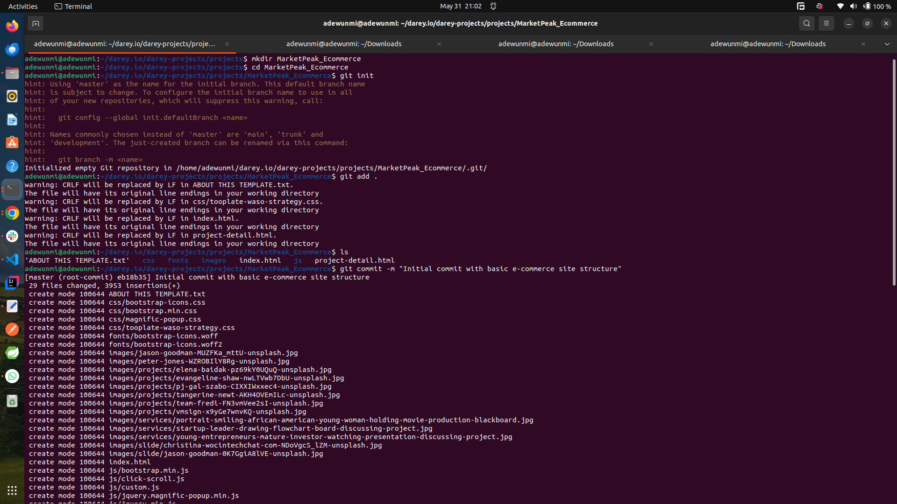

- An AWS ec2 instance was set up for deployment of the website. </br>
The screenshot below shows the installation of git on the server after it was accessed with `ssh`
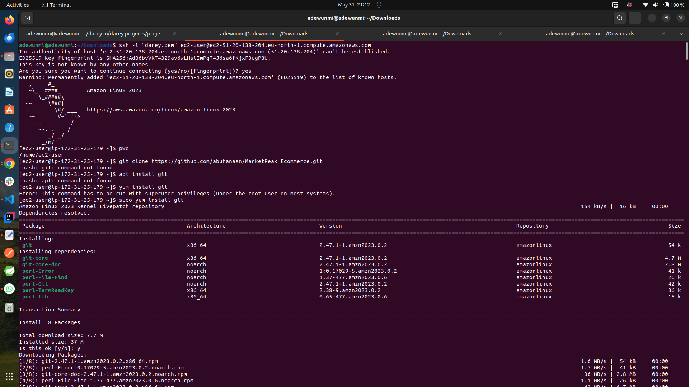

- The codebase was cloned into the ec2 instance running the command below:

```bash
git clone https://github.com/abuhanaan/MarketPeak_Ecommerce.git
```

Screenshot below shows the clone operation:
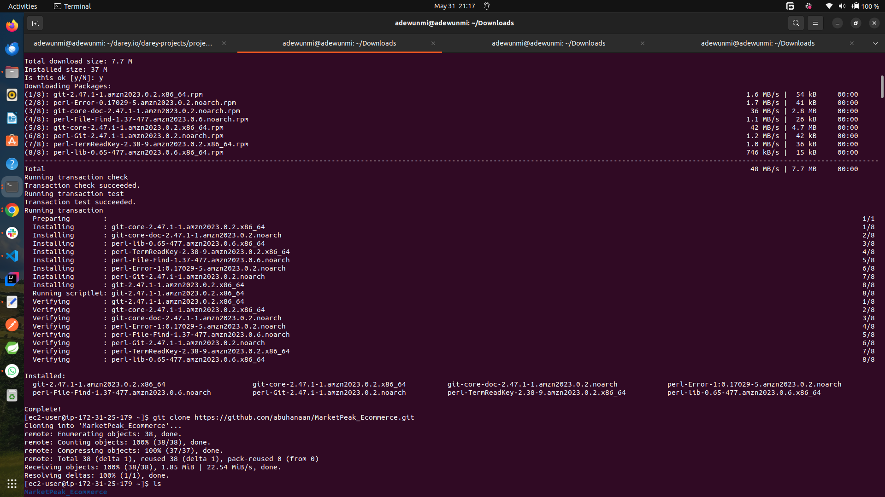

- Apacher web server was installed on the ec2 instance using the commands below:

```bash
sudo yum update -y
sudo yum install httpd -y
sudo systemctl start httpd
sudo systemctl enable httpd
```

Screenshots below show the apache installation operation:
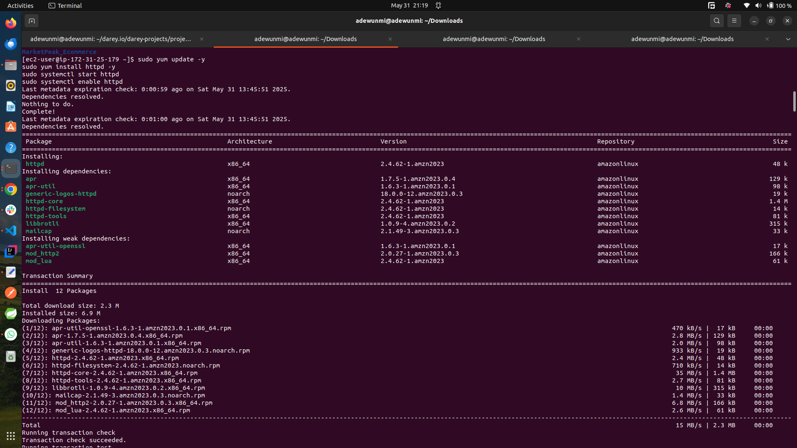
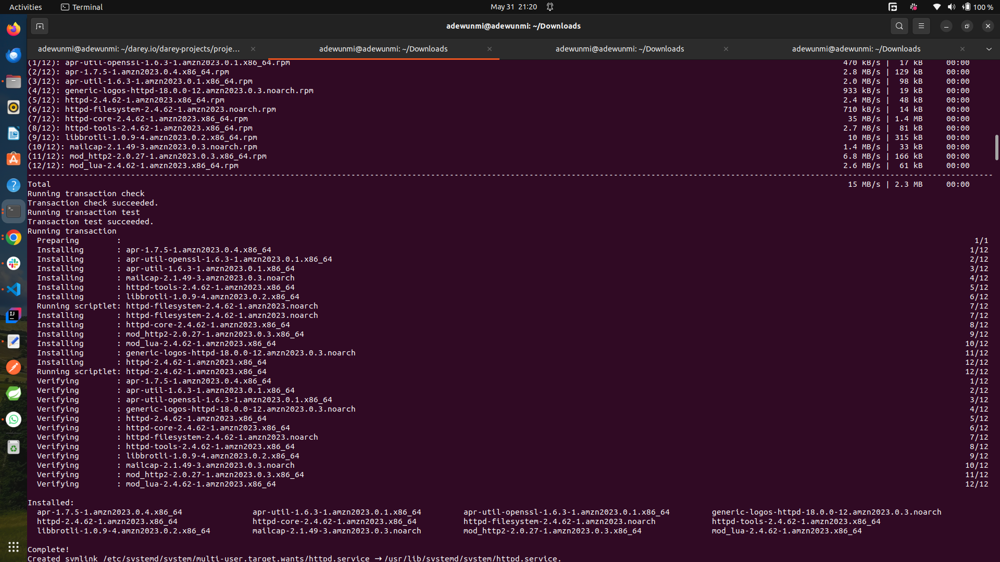

- httpd was configured on the ec2 instance to serve the site. This configuration points to the directory on server where the website code files are stored usually in `/var/www/html`.
This configuration was achieved by clearing the default httpd web directory and copying Market-Peak code file into it using the commands below:

```bash
sudo rm -rf /var/www/html/*
sudo cp -r ~/MarketPeak_Ecommerce/* /var/www/html/
```

- To apply the changes, the httpd service was reloaded by running:

```bash
sudo systemctl reload httpd
```

The screenshot below shows httpd configuration
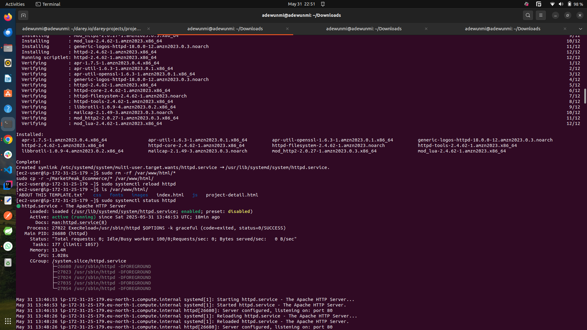

### Challenges

After reloading httpd, the website couldnt be accessed, while trying to troubleshoot, the steps below was taken:

- I checked the error_log to see what went wrong with th server, the error_log didnt actually show any sinificant error.

- I checked if any firewall was blocking the website from being served but no firewall was running on the server.

- I tested the site locally by running:

```bash
curl http://localhost
```

The above command actually returned the expected response which was an html code of the index page. </br>

The screenshot below shows the troubleshooting process:
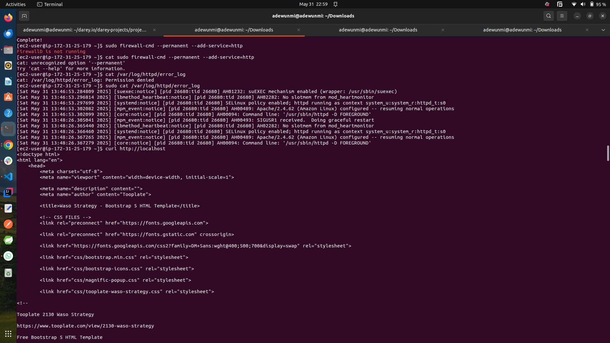

- I tried checking the status of `httpd` by running:

```bash
sudo systemctl status httpd
```

- I also tried what Apache is listening on by running:

```bash
sudo netstat -tulpn | grep httpd
```

- I also confirmed that files in the /var/www/html directory are readable by Apache

```bash
sudo chown -R apache:apache /var/www/html
sudo chmod -R 755 /var/www/html
```

- The screenshot below shows the port troubleshooting process:
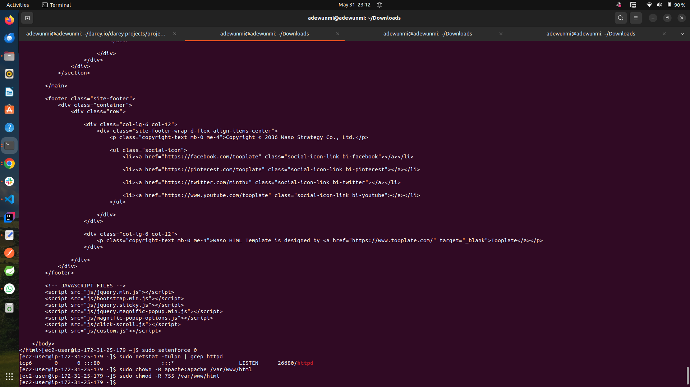

I noticed it was running and listening on port 80. At this point I went back to the AWS console and checked the security rule the ec2 instance was running on, then I noticed port 80 wasnt opened on the inbound rule. I added port 80 to inbound rule. </br>
I checked again and I noticed the site was still not accessible. This time I was actually accessing it using https, I switched to https and voilla!!! the site was now accessible.

The screenshot below shows the site being accessed from a browser:


### Continous integration and deployment Workflow

- A new branch was locally created to add a new feature to the website.

```bash
git branch development
git checkout development
```

- After making changes locally, the changes were staged, commited and pushed to remote repository using the commands:

```bash
git add .
git commit -m "Add Pricing To Navbar"
git push origin development
```

Screenshot showing continous integration
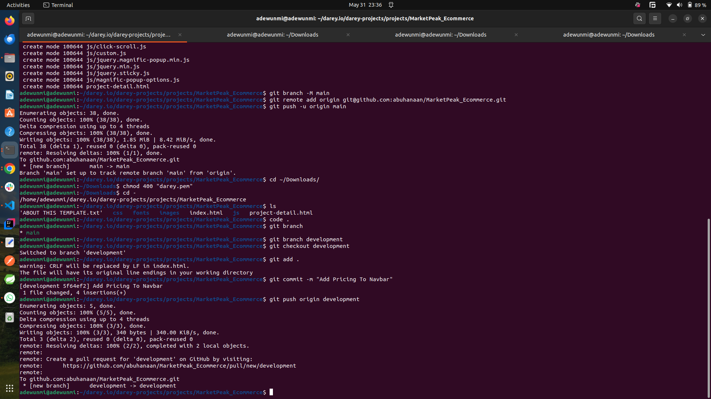

- A pull request was created on github interface and new changes were merged to the main branch.

The screenshots below show the PR creation and merging process on gihub

- 
- 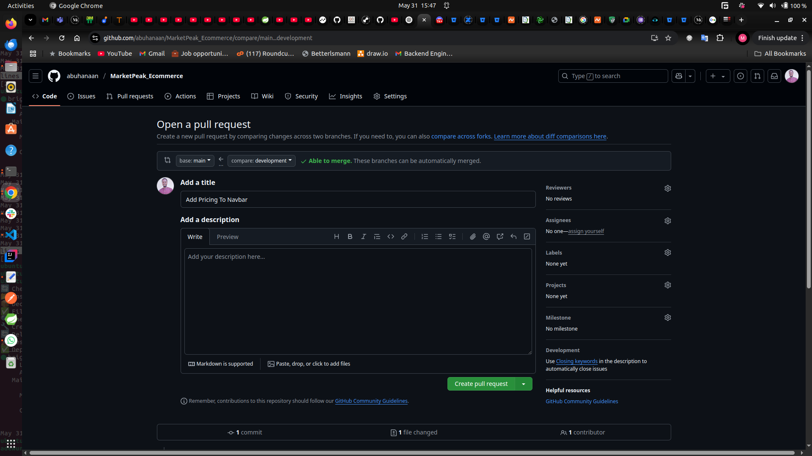
- 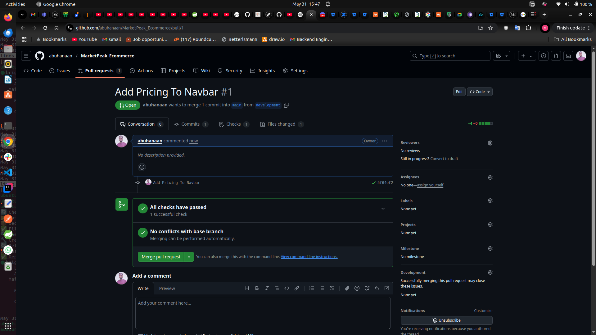
- 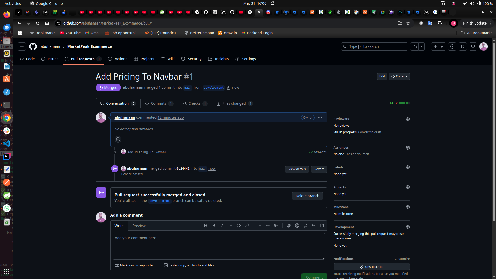

- I updated the codebase on th server and reloaded httpd:

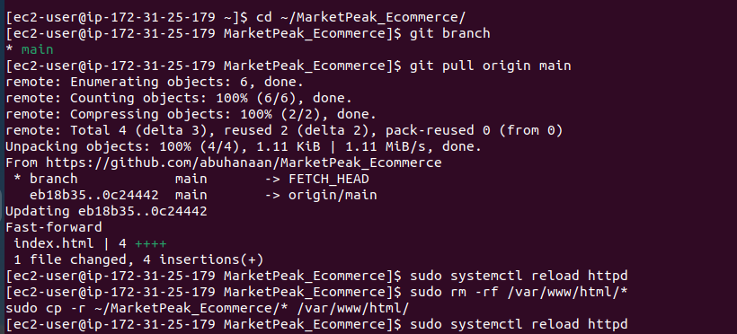

- I accessed the website once again and the changes got effected


